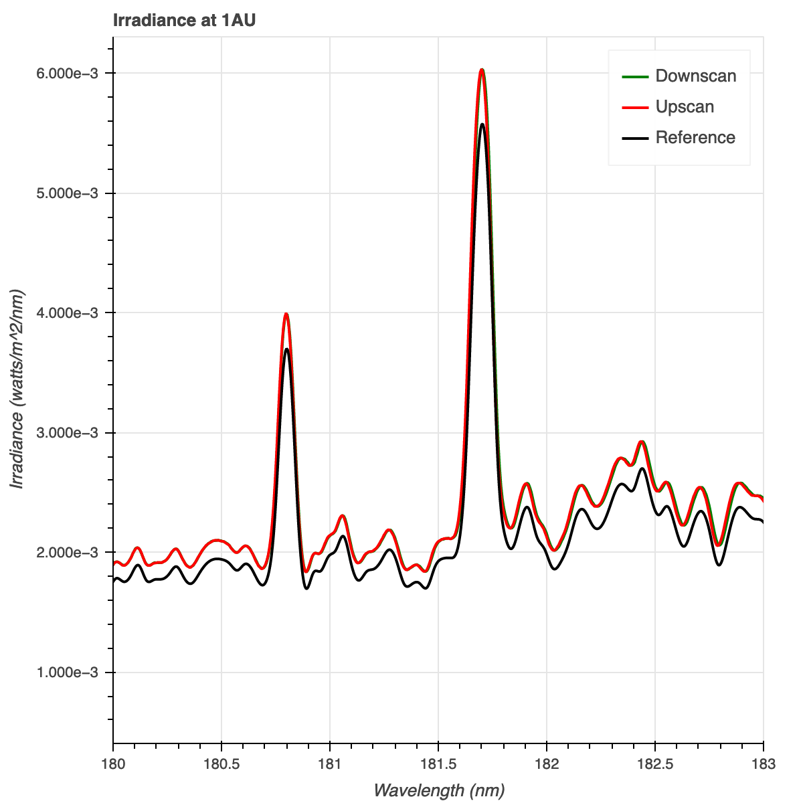

# LASP Solar Irradiance Exercise

This repository contains software and supporting materials for an exercise to calculate the solar irradiance
using data from the SOlar Stellar Irradiance Comparison Experiment (SOLSTICE) Experiment.  This README serves as a
summary of the exercise.

See `exercise_instructions.txt` for more information about SOLSTICE, the goals of this exercise, as well as the various
data and calculations used.

The main software to perform this exercise is contained within the `exercise.py` module.  The `data/` directory
contains the data from the SOLSTICE instrument (described further in the [data](#data) section), and the
`plots/` directory contains plots of the results (described further in the [results](#results) section).  The
`requirements.txt` and `environment.yml` file contain the dependencies needed to install and run the software
(described further in the [installation](#installation) section).

## Table of Contents

1. [Installation and Usage](#installation)
2. [Data](#data)
3. [Results](#results)
4. [Software Design and Approach](#design)
5. [Assumptions and Shortcomings](#shortcomings)
6. [Potential Improvements](#improvements)

## Installation and Usage <a name="installation"></a>

The software is intended to run in a Python 3 environment, however it has only been tested with Python 3.9 specifically.

There are only a few third-party dependencies required to run the software, which are provided in `requirements.txt`.
To install these, run:

```
pip install -r requirements.txt
```

Another option for installing the necessary dependencies is using `conda`.  More information about `conda` and how to
acquire/install it can be found here:

- [Miniconda](https://conda.io/miniconda.html) or
- [Anaconda](https://www.continuum.io/downloads)

With `conda` is installed, users can install the environment by running:

```
conda create -n <env_name> -f environment.yml
```

where `<env_name>` is the name you wish to call the environment.

## Data <a name="data"></a>

Several collections of data were used to perform this exercise.  Data are provided in various CSV files (described below).
For temporal data, time measurements are recorded as the number of microseconds since `1980-01-06 00:00:00.000`
(labeled as `microsecondsSinceGpsEpoch`).  The data for this exercise cover a timespan of roughly 8 hours, while
telemetry measurements of detector temperatures and instrument distances/velocity cover roughly 12 hours.

- `detectorTemp.txt`: Contains measurements of the detector temperature over time (labeled as `temp`), in units of
  degrees Celsius
- `distanceAndDoppler.txt`: Contains corrections for the changing distance and velocity of the spacecraft with respect
  to the Sun.  These are labeled as `sunObserverDistanceCorrection` and `sunObserverDopplerFactor`, respectively.
- `instrumentTelemetry.txt`: Contains measured detector counts (labeled as `counts`) for varying grating positions (labeled
`gratPos`) over time.
- `integrationTime.txt`: Contains the setting for the integration time (in milli-seconds) of the instrument over the course
of the experiments (labeled as `intTime`).  It is assumed that the integration times remain constant until they are changed.
- `plans.txt`: Contains the timestamps for the start  and end times of each of the three experiments (labeled `startTime` and
`endTime` for each `planName`, respectively)
- `referenceSpectrum.txt`: Contains the irradiance (in watts/m<sup>2</sup>/nm) over a range of wavelengths (in nm) for a reference
spectrum.  This spectrum is used to compare results of the experiment to.

The plot below shows the values of the data described above over time or wavelength.  The green, gray, and red shaded
regions signify the time coverage of the DownScan, Dark, and UpScan experiments, respectively.  You may click on the plot
in order to expand it.

<p align="center">
  
</p>

## Results <a name="results"></a>

The following plot shows the irradiance (in watts/m<sup>2</sup>/nm) for the DownScan (green) and UpScan (red) over a
wavelength range of 180nm -183 nm.  This wavelength range was chosen to showcase the two emission lines located near \~180 nm.
The values provided are irradiances as they would be measured from a distance of 1AU.  The plot also displays the
reference spectrum (black).

<p align="center">
  
</p>

The next plot displays the ratio of the DownScan irradiances and the reference spectrum (green), as well as the ratio of
the UpScan irradiances and the reference spectrum (red).  This is also shown over the 180nm - 183nm wavelength range.

<p align="center">
  
</p>

## Software Design and Approach <a name="design"></a>

The following points describe some of the design decisions that I made when writing the software to support this exercise:

- I chose Python as the primary programming language to work on this exercise, as this is the language I am most comfortable with
and use on a day-to-day basis.  Python is a popular, well supported, modern, open-source language, and has many useful third-party libraries to help manage and store data/information (e.g. `pandas`), perform scientific calculations (e.g. `numpy`), and visualize results (e.g. `matplotlib` or `bokeh`).  Because Python is an interpreted, dynamically typed language, it tends to perform slower than other languages such as `C`, however, since this exercise is rather small-scale (i.e. not dealing with a lot of data) and scince results need not be computed in a real-time environment, speed is not really a concern.

- I used an object-oriented approach within the Python code.  The code utilizes a class (which I called
`IrradianceExercise`) and utilizes attributes and methods to complete the exercise as opposed to a functional approach that
would instead use a series of functions.  One advantage of this approach is that it reduces the number of variables that need
to be passed around within the code. Since this exercise deals with a fair number of data files, measurements, and
constants, I decided to store these components within the class object itself (i.e. `self`) such that they could easily be
accessed across different methods.

- I split up the various calculations into their own methods (e.g. `calculate_wavelength`, `calculate_count_rate`, etc.) as I
believe this makes the code more readable overall.  That is, it should be relatively obvious what a particular method's purpose is just from a a quick glance.  I also created separate methods for strictly plotting purposes, as well as reading in and
organizing the data.

- I named some of the methods using a leading underscore (e.g. `_convert_to_datetime`) to indicate that these methods are only used
'internally' within the class object.  In other words, these methods do not get called directly, rather they get called by _other methods within the class_.  While this does not change the behavior of the method in any way, not make the method private, it
is considered a good practice.

- I followed the [`PEP08`](https://www.python.org/dev/peps/pep-0008/) style guide and
[`PEP257`](https://www.python.org/dev/peps/pep-0257/) docstring conventions (with only a few exceptions) in order to make the code
more readable and standardized.  This helps for other developer to be able to read, understand, and perhaps maintain or contribute
to the code in the future.  These conventions include standardized class/method/variable naming conventions, alphabetical ordering
of methods, consistently structured docstrings, and more.  One major exception to this is that I did not follow the convention of
limiting lines of code to 80 characters, as I find this convention to be a bit antiquated (we no longer use punch cards) and in
many cases will cause the code to be _less_ readable.  I did however split up lines of code that were exceptionally long (\~120
characters).

- I chose the `pandas` library for reading in and storing data from CSV files. After reading in data, `pandas` automatically stores
the data in a table-like object, and columns of data can be easily accessed through attributes.

- I chose the `bokeh` library for plotting, as it is relatively simple to make nicely formatted, interactive plots.  Since
this exercise is exploratory in nature, I felt that it was important to have interactive plots instead of static plots, so that
I could easily pan around and/or zoom in on particular areas of the plot.

## Assumptions and Shortcomings <a name="shortcomings"></a>

While this object-oriented approach has its advantages, there are also a few shortcomings to this approach that should
be noted:

- This design does not lend itself very well to unit testing.  Most of the methods (especially those that perform calculations)
are using data or results stored within the `self.data` or `self.results` attributes, and thus the methods assume the
existence of these attributes and assume that they are structured in a certain way.  In order to test a particular method
individually, one must do some work beforehand to set up the `self.data` and/or the `self.results` attributes.  On the other
hand, it would be relatively straightforward to perform regression testing on the software; the data files that come with
this exercise could be considered test data, and the results of these experiments could be used to test the software if
future changes are made.

- This design also does not lend itself well to adding other experiments easily.  Several of the variables are essentially
hard-coded around the specific DownScan and UpScan experiments (e.g. `wavelengths_downscan`, `wavelengths_upscan`,
`wattsPerM2_downscan`, `wattsPerM2_upscan`etc.).

- Through this design, all of the data used in the experiment, as well as results data, are stored in memory via the `self.data` and `self.results` attributes, respectively.  While this is adequate for this particular exercise, this approach would potentially
not scale well with larger datasets (for example, if you wanted to use the data over the entire lifetime of the instrument or
mission). In that case, an external storage method (perhaps a database or filesystem) may be required.

I also made a few assumptions about the data and/or results, notably:

- While calculating the wavelengths, I applied a correction for the doppler factor, though it was not mentioned in the
instructions.  I assumed that the `sunObserverDopplerFactor` should be used to correct the wavelengths for any changes in the
velocity of the spacecraft during the experiment.  There are no units given for `sunObserverDopplerFactor` and I am not
sure this is how the correction should be applied.  These lines of code (within the `calculate_wavelengths` method) could easily be removed if this correction is unnecessary.  I compared the calculated wavelengths before and after applying this correction,
and the differences were only \~0.001%.

- There is a small discrepancy between the times at which grating data and temperature data were collected.  This caused some
difficulty when applying the correction to the count rate to account for changes in detector temperature (see the
`calculate_count_rate_corr` and `calculate_median_dark_count_rate` methods).  To get around this discrepancy, I wrote a method
(`_find_closests_measurements`) to find the temperature measurement taken closest in time for a given count rate measurement.
Though the differences in times are quite small, this introduces some uncertainty in the count rate, since the applied temperature
correction will be somewhat innaccurate.  Perhaps there is a better or more accurate way to apply the temperature correction that
I overlooked; given more time, it would be worth exploring other ways to more accurately correct for temperature differences.

- Much like the temperature correction discrepancy mentioned in the last point, there is a discrepancy between the wavelengths
calculated from the grating positions and the wavelengths given in the reference spectrum data.  This poses a problem when
trying to calculate the ratio of irradiances between the UpScan/DownScan and the reference spectrum.  To get around this, I
found the reference spectrum wavelength that matched the grating position wavelength the closest.

- The instructions mention a "ConstantWavelength" experiment, but the experiment is not listed in `plans.txt` as an experiment
that was performed.  I assume that this was mentioned in the instructions as a means to describe how and why the temperature
correction is needed.


## Potential Improvements <a name="improvements"></a>

Given some more time, there are several improvements that could be made to this software:

- The code could be made more DRY (i.e. Don't Repeat Yourself) in that there is a lot of repeated code for DownScan and UpScan experiments.  This could be avoided by modifying the design to allow an experiment (i.e. `experiment_name`,
`experiment_start_time`, `experiment_end_time`) to be a variable component.

- Unit and/or regression tests could be developed that test most, if not all methods of the `IrradianceExercise` class.
Furthermore, a continuous integration solution could be built (for example, with Travis, Jenkins, or GitHub Actions) that automatically installs the software in the environment described in `requirements.txt`/`environment.yml` and performs unit/regression tests when code is pushed to GitHub.

- This software doesn't implement any checks to ensure that required data are present, or checks that help make sure that particular methods don't break when given unexpected input (in other words, this code has no `try`/`except` blocks or error
handling).  Such checks could be added to make sure that data flows through the system appropriately and that particular
conditions are met.

- The software could be made into an installable package by restructuring the repository, adding appropriate `__init__.py`
files, and adding a `setup.py` file.  This could make the installation of the software easier (e.g. a simple `pip install`).

- Additional plots, tables, and/or output messages could be added throughout the exercise in order to check that
individual calculations (.e.g. `calculate_count_rate`) yield their expected results.


## Conclusion

I would like to thank the folks at LASP for the opportunity to showcase my work.  It had been quite some time since i've thought
about some of these equations (probably since my time at Florida Tech in ~2010).  It was fun to apply that knowledge again!
